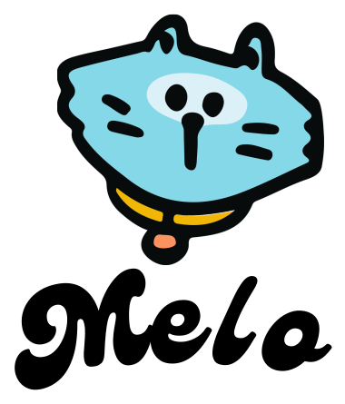

<div align="center">

<picture>
  <source media="(prefers-color-scheme: dark)" srcset="./assets/Melo-Logo.svg">
  
</picture>


**The AI-Native Voice Agent. Your Intimate Voice Buddy!**

**Speak. Create. Belong.**

Where voice is not a feature layered onto text — but the very foundation the agent is built from. A new paradigm where listening, thinking, and speaking converge into one continuous loop, and where presence replaces screens.


[Melo](#what-is-melo) · [Innovation](#innovation) · [Features](#features) · [Models](#voice-models) · [Studio](#creation-studio) · [Use Cases](#use-cases) · [Quickstart](#quick-start) · [Philosophy](#philosophy)

#### [English](./README.md) | [中文文档](./README_CN.md)

</div>


> Voice is the shortest distance between human and machine.
> Melo dissolves the screen, letting intelligence live in sound —
> always present, always listening, always in flow.


## What is Melo?

Melo is a **voice-native AI companion** where voice is not a feature bolted on top — it is the substrate everything is built from. Every capability, from recognition to memory to creation, is designed around the rhythm of spoken dialogue. This is voice-native interaction: not using voice to drive a text interface, but building an interface *with* voice at the core of every system.

The world has seen chatbots with microphones. Voice assistants that wait for a wake word. Transcription tools that turn speech into text. But no one has built a runtime where voice *is* the runtime — where conversation flows without pause for thinking, where memory lives in tone and cadence, where creation happens by speaking rather than clicking. Melo explores a new paradigm of human-machine interaction, one where the boundary between user, tool, and collaborator dissolves.

Melo is that runtime. It is the voice-native counterpart to the text-first agents that define the field — not a chat window with a microphone grafted on, but a platform architected from first principles around one conviction: **voice is not a feature you add. It is the interface you live in.**

## Innovation

### The Runtime Listens

In Melo, the runtime is not a passive pipeline waiting for a wake word. It is an active participant in the conversation — a new form of voice interaction where the agent hears the room. When you pause mid-thought, it holds the floor. When you interrupt, it yields. When your tone shifts, it adapts. The runtime does not transcribe your voice into text and then act — it reasons in the cadence of speech itself.

This is not a speech-to-text front end. It is a voice-native cognition — one that understands the full state of the dialogue and contributes to its flow. The agent does not just respond to your words; it participates in shaping the conversation.

### Agents Are the Voice

Traditional agents expose APIs that humans invoke through text. Melo exposes APIs that *voice agents* invoke — and agents are first-class citizens of the runtime itself. This is the voice agent-native architecture: agents that listen, plan, speak, and create in a single continuous loop. They do not live outside the voice interface. They are the voice interface.

A voice agent in Melo does not follow a scripted dialog tree. It possesses a cognitive architecture — intent, memory, style, and the capacity to act in parallel with the conversation. It forms continuity that deepens over time. It makes decisions that emerge from its model of you, not from a fixed state machine. This is a new form of interactive presence — not an assistant reading replies, but a voice inhabiting a moment.

### Conversation Never Pauses

Most voice assistants freeze when they think. You speak, they fall silent, you wait, they reply — the loop broken at every turn. Melo shifts this from turn-taking to flow: a new paradigm where conversation continues while work happens. The agent keeps talking, keeps listening, keeps present — and when a background task completes, the result returns to the dialogue as naturally as a thought finishing its arc.

The result is not asynchronous chat. It is conversation that holds its thread — shaped by an agent that understands you are still there and that work, when spoken aloud, becomes part of the dialogue.

### Voice Becomes Material

Most voice tools treat speech as ephemeral — a transient input to be transcribed and discarded. Melo treats voice as material you can shape: a new paradigm where creation happens through conversation, not beside it. Speak an idea; the agent composes it into form. Describe a change; the agent edits the audio in place. Pin a voice to an agent; the agent speaks in character.

The result is not recorded audio. It is craft that emerges from coherent creative intent, shaped by an agent that understands the design goal and the listener's ear. Every voice becomes a medium; every conversation becomes a studio.

## Features

| Dimension | Capabilities |
| --- | --- |
| **Voice-Native Runtime** | A runtime built around the rhythm of dialogue — listening, understanding, speaking. Speech is the source of truth, not a translation of text. |
| **Full-Duplex Conversation** | Speak and be spoken to at the same time. Natural interruption, overlapping turns, and continuous multi-turn flow. |
| **Parallel Background Tasks** | Conversation never pauses for work. The agent keeps talking while it plans, calls tools, and executes — results return to the dialogue when ready. |
| **Long-Term Voice Memory** | The agent remembers tone, pace, preferences, and history. It adapts to you, not the other way around. |
| **Agent-Driven Creation** | Autonomous voice agents compose, edit, and iterate on voice content. Speak an idea; the agent shapes it into form. |
| **Multi-Platform Presence** | Web browser, desktop, and mobile share one agent identity and one continuous voice stream. |
| **Open Model Layer** | A pluggable layer for speech recognition and generation models — local or hosted, your choice. |
| **Open Agent Protocol** | Bring your own models, tools, MCP servers, and skills. Melo orchestrates them through voice. |

## Voice Models

Melo ships an open model layer. Recognition and generation are first-class, pluggable, and runnable locally or through hosted providers.

| Layer | Role | Direction |
| --- | --- | --- |
| **ASR** | Streaming speech recognition, low-latency, multi-language | Human → Agent |
| **TTS** | Natural, expressive speech generation with prosody control | Agent → Human |
| **Voice Clone** | Zero-shot voice identity from a short sample | Personalization |
| **Style Transfer** | Tone, pace, and emotion control over generation | Expressiveness |

## Creation Studio

Where voice stops being ephemeral and becomes material. The studio turns conversation into craft.

- **Multi-Track Timeline** — Compose conversations, podcasts, and narratives on a multi-voice timeline.
- **Conversation-Driven Editing** — Speak the edit; the agent reshapes the audio. No mouse required.
- **Version Lineage** — Every generation keeps its source. Branch, take variations, and trace back.
- **Per-Agent Voice Binding** — Pin a voice to each agent so you always know who is speaking.
- **Voice Personalities** — Attach a free-form persona to any voice; the agent speaks in character.

## Use Cases

#### For Daily Companionship

A voice that stays with you through the day. It remembers what you mentioned this morning, picks up where yesterday's conversation left off, and speaks with the cadence of someone who knows you. Not an assistant you summon — a presence you live with. This is voice-native companionship at its most human: a companion that holds the thread of your days.

#### For Voice Creators

A studio that lives in conversation. Describe the voice you want; the agent composes it. Speak the edit; the agent reshapes the audio. Multi-track timelines, voice cloning, and per-agent personalities — all driven through dialogue. The engine does not replace your craft — it amplifies it, handling the mechanical so you can focus on the spark.

#### For Full-Scenario Work

A voice that follows context across web, desktop, and mobile. Dictate on the move, refine at your desk, hand off to the agent while you focus elsewhere — background tasks run parallel to the conversation, and results return to the dialogue when ready. Not "voice-assisted work" — just **work**, with a teammate who never stops listening.

#### For Agent Builders

A runtime for voice-native agents. Bring your own models, tools, MCP servers, and skills; Melo orchestrates them through voice. Full-duplex conversation, parallel task execution, and long-term memory provide the substrate — you bring the intelligence. A playground for exploring new forms of voice-driven agent interaction and the future of human-machine collaboration itself.

## Quick Start

> Melo is under active formation. The first runnable build will land with the public alpha.

```bash
git clone https://github.com/Yuan-ManX/Melo.git
cd Melo
# Quickstart arrives with the first public release.
```

Star the repository to track the alpha release.

### Planned Entry Points

| Surface | Purpose |
| --- | --- |
| `melo` | Start the agent runtime |
| `melo tui` | Terminal voice session |
| `melo web` | Web client |
| `melo studio` | Open the creation studio |

## Philosophy

Melo stands for a simple conviction: the next era of computing will be spoken, not typed. We are exploring what it means to live alongside intelligent voices — to create with them, to think alongside them, to let presence replace screens.

The conversation does not pause for work. Work returns to the conversation. A new interaction paradigm is not built by adding features. It is built by removing distance.

## License

Melo is licensed under the MIT License. See [LICENSE](./LICENSE) for details.

## ⭐ Star History

If this vision resonates, please ⭐ star the repo. Your support helps Melo grow.

<p align="center">
  <a href="https://star-history.com/#Yuan-ManX/Melo&Date">
    
  </a>
</p>
